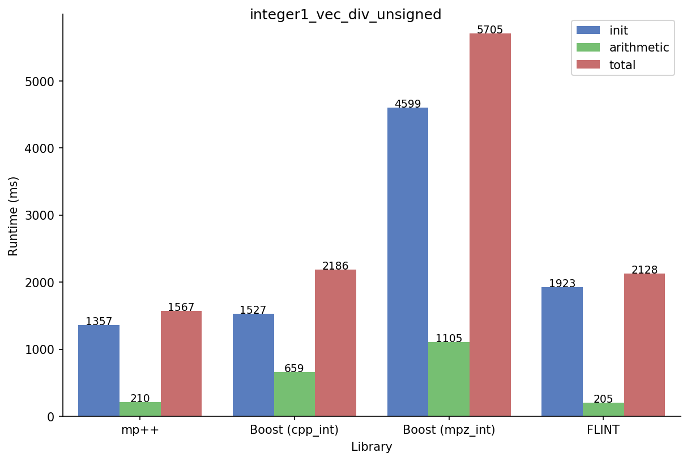
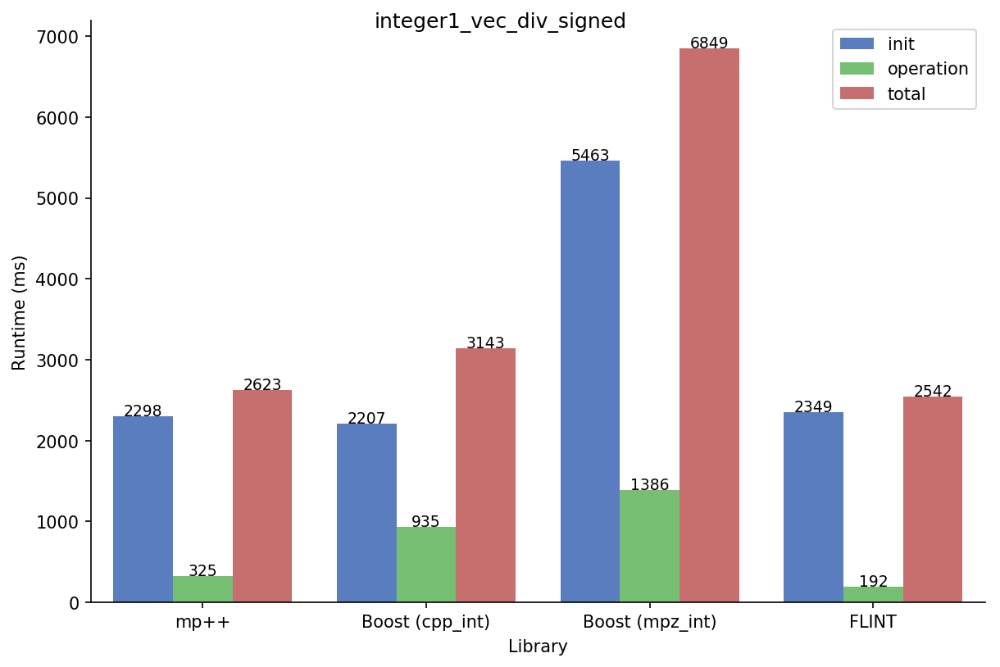
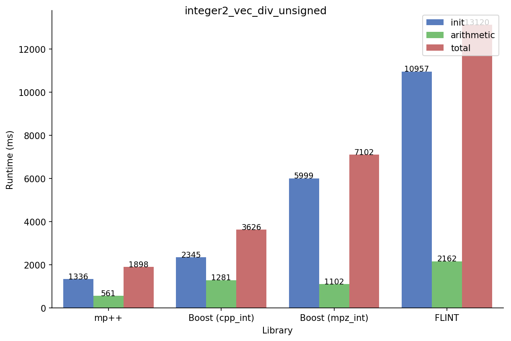
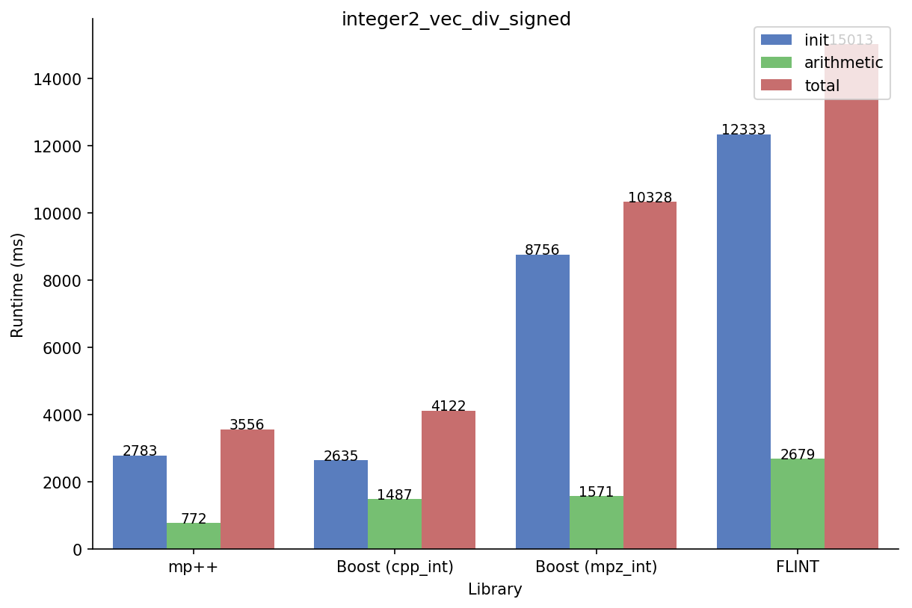

Integer benchmarks
------------------

.. _integer_dot_product:

Dot product
^^^^^^^^^^^

This benchmark measures the time needed to compute the dot product of two integer vectors of size
:math:`3\times 10^7` containing randomly-generated values. For each benchmarked library, the timings
are split into three bars:

* the ``init`` bar, which accounts for the time needed to initialise the vectors of integers,
* the ``arithmetic`` bar, which represents the time needed to perform the dot product,
* the ``total`` bar, which represents the total runtime of the benchmark.

The multiply-add primitives of each library are used for the accumulation of the dot product. The benchmark
is run in a variety of different setups.

.. _integer1_dot_product_unsigned:

1-limb unsigned integers
........................

In this setup, the integer vectors are initialised with small *non-negative* values, and the final dot product
is less than :math:`2^{64}`. mp++ integers with 1 limb of static size are employed.

.. figure:: _static/integer1_dot_product_unsigned.png
   :scale: 50%
   :align: center

It can be immediately seen how the initialisation cost for the ``mpz_int`` class is much higher than for the other
integer types. This is due to the fact that the GMP API always uses dynamically-allocated memory, even for small values.
The other integer types all employ a small-value optimisation, and thus avoid the performance cost of heap allocation.

In this particular benchmark, mp++ is about 3 times faster than GMP (as measured via the ``mpz_int`` wrapper)
in the arithmetic portion of the benchmark. mp++ is also faster than ``cpp_int`` and FLINT, albeit by a smaller margin.

1-limb signed integers
......................

This setup is almost identical to the :ref:`previous one <integer1_dot_product_unsigned>`, but this time the vectors
are initialised with both positive *and* negative values.

.. figure:: _static/integer1_dot_product_signed.png
   :scale: 50%
   :align: center

The presence of both positive and negative values has a noticeable performance impact with respect to the previous test
for all libraries, both during the initialisation of the vectors and in the arithmetic part of the benchmark.
This is due to the fact that sign handling in multiprecision computations is typically implemented
with branches, and when positive and negative values are equally likely the effectiveness of the CPU's branch predictor
is much reduced.

The performance advantage of mp++ with respect to the other libraries is retained, albeit by a smaller margin.

.. _integer2_dot_product_unsigned:

2-limb unsigned integers
........................

This setup is the 2-limb version of the :ref:`1-limb unsigned benchmark <integer1_dot_product_unsigned>`:
the vectors are initialised with larger non-negative values, the final result is less than :math:`2^{128}`, and
mp++ integers with 2 limbs of static size are now employed.

.. figure:: _static/integer2_dot_product_unsigned.png
   :scale: 50%
   :align: center

The benchmark shows that mp++'s specialised arithmetic functions pay off in terms of raw performance in this scenario.

2-limb signed integers
......................

This setup is the signed version of the :ref:`previous benchmark <integer2_dot_product_unsigned>`.

.. figure:: _static/integer2_dot_product_signed.png
   :scale: 50%
   :align: center

As explained earlier, arithmetic with mixed positive and negative values is more expensive than arithmetic with only
non-negative values.

.. _integer_vec_mul:

Vector multiplication
^^^^^^^^^^^^^^^^^^^^^

This benchmark is very similar to the :ref:`dot product benchmark <integer_dot_product>`, with one crucial difference:
instead of accumulating the dot product of two randomly-generated vectors of size :math:`3\times 10^7` into a scalar
value, the element-wise product of the two vectors is stored in a third vector, and the final
dot product is computed as the sum of the values in this third vector.

This allows to measure the efficiency
of the multiplication and addition operations (whereas in the dot product benchmark the multiply-add primitives were
employed), and it also increases the pressure on the memory subsystem (due to the need to write the elements' products
into a vector rather than accumulating them directly into a scalar).

.. _integer1_vec_mul_unsigned:

1-limb unsigned integers
........................

In this setup, the integer vectors are initialised with small *non-negative* values, and the final result
is less than :math:`2^{64}`. mp++ integers with 1 limb of static size are employed.

.. figure:: _static/integer1_vec_mul_unsigned.png
   :scale: 50%
   :align: center

This time mp++ is more than 5 times faster than GMP in the arithmetic portion of the benchmark, while still maintaining
a performance advantage over ``cpp_int`` and FLINT.

1-limb signed integers
........................

In this setup, the vectors are initialised with both positive *and* negative values.

.. figure:: _static/integer1_vec_mul_signed.png
   :scale: 50%
   :align: center

We can see again how the introduction of mixed positive and negative values impacts performance negatively with respect
to the :ref:`unsigned setup <integer1_vec_mul_unsigned>`.

.. _integer2_vec_mul_unsigned:

2-limb unsigned integers
........................

This setup is the 2-limb version of the :ref:`1-limb unsigned benchmark <integer1_vec_mul_unsigned>`:
the vectors are initialised with larger non-negative values, the final result is less than :math:`2^{128}`, and
mp++ integers with 2 limbs of static size are now employed.

.. figure:: _static/integer2_vec_mul_unsigned.png
   :scale: 50%
   :align: center

The benchmark shows again that mp++'s specialised arithmetic functions deliver strong performance.

2-limb signed integers
........................

This setup is the signed version of the :ref:`previous benchmark <integer2_vec_mul_unsigned>`.

.. figure:: _static/integer2_vec_mul_signed.png
   :scale: 50%
   :align: center

Vector division
^^^^^^^^^^^^^^^

This benchmark is the division analogue of the :ref:`vector multiplication benchmark <integer_vec_mul>`: the element-wise
division of two randomly-generated vectors of size :math:`3\times 10^7` is stored in a third vector, and the sum
of all the values in the third vector is computed.

.. _integer1_vec_div_unsigned:

1-limb unsigned integers
........................

In this setup, the integer vectors are initialised with small *non-negative* values.
mp++ integers with 1 limb of static size are employed.

mp++ and FLINT perform well on this test, and they are about 5 times faster than GMP.

1-limb signed integers
........................

In this setup, the vectors are initialised with both positive *and* negative values.

Here we can see FLINT pulling ahead of mp++. FLINT uses a signed integer representation for small values
that allows to avoid branching based on the signs of the operands.
Coupled to the fact that there's no need to do overflow checking during division,
FLINT's implementation has a distinct performance advantage in this specific test.

.. _integer2_vec_div_unsigned:

2-limb unsigned integers
........................

This setup is the 2-limb version of the :ref:`1-limb unsigned benchmark <integer1_vec_div_unsigned>`:
the vectors are initialised with larger non-negative values, and
mp++ integers with 2 limbs of static size are now employed.

2-limb signed integers
........................

This setup is the signed version of the :ref:`previous benchmark <integer2_vec_div_unsigned>`.

Sorting
^^^^^^^

This benchmark consists of the sorting (via ``std::sort()``) of a randomly-generated vector of :math:`3\times 10^7` integers.

1-limb unsigned integers
........................

In this setup, the integer vector is initialised with small *non-negative* values. mp++ integers with 1 limb of static size are employed.

.. figure:: _static/integer1_sort_unsigned.png
   :scale: 50%
   :align: center

Here again it can be seen how the small-value optimisation implemented in mp++, ``cpp_int`` and FLINT pays off on large
datasets with respect to plain GMP integers. mp++ shows a modest performance increase with respect to ``cpp_int``
and FLINT.

1-limb signed integers
......................

In this setup, the vector is initialised with both positive *and* negative values.

.. figure:: _static/integer1_sort_signed.png
   :scale: 50%
   :align: center

2-limb unsigned integers
........................

In this setup, the integer vector is initialised with *non-negative* values in the :math:`\left[2^{64},2^{128}\right)` range.
mp++ integers with 2 limbs of static size are employed.

.. figure:: _static/integer2_sort_unsigned.png
   :scale: 50%
   :align: center

2-limb signed integers
......................

In this setup, the vector is initialised with both positive *and* negative values in the :math:`\left(-2^{128},2^{128}\right)` range.
mp++ integers with 2 limbs of static size are employed.

.. figure:: _static/integer2_sort_signed.png
   :scale: 50%
   :align: center
